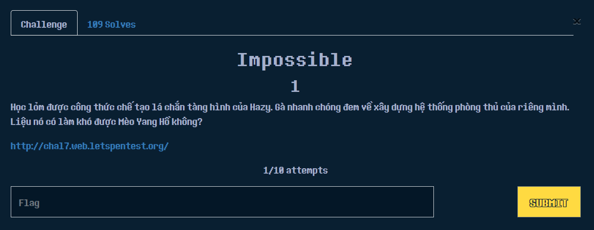

# Cookie Hân Hoan

## **Cryptography**

1. **XOR**

.png>)





á» bài này há» sẽ cho ta 1 file encrypt.py và 1 file cipher.txt. Đúng với tên bài, tóm tắt những việc mình sẽ cần làm là tìm ra key và sau đó viết 1 đoạn script để có thể thực hiện tìm flag dựa trên key vừa tìm được. 

Phép toán XOR tương ứng cú pháp ^ (mọi người có thể tự tìm hiểu thêm về XOR trên google nhé)

Đầu tiên file cipher.txt sẽ cho mình 1 chuỗi hex `6c464b4d514b744817491714487449174b57`

Với định dạng cờ là Flag{}, mình sẽ nghĩ đến với việc XOR thử kí tự F ^ 6c (mục đích tìm ra key), bạn có thể vào link [http://xor.pw/#](http://xor.pw/#) để thực hiện tính nhé.

.png>)

Như bạn đã thấy thì sau khi XOR F với 6c thì output (key) sẽ là 2a, nếu không chắc chắn, có thể thử tiếp kí tự l với 46, l ^ 46 = 2a. Okay giờ chúng ta đã có key, thực hiện 1 đoạn code dưới đây (ở đây mình dùng C)

```
#include <stdio.h>
#include <string.h>

int main(int argc, char *argv[])
{
    int key = 0x2a;
    char flag[18]; //khởi tạo mảng flag tối đa 18 kí tự
    int cipher[] = {0x6c,0x46,0x4b,0x4d,0x51,0x4b,0x74,0x48,0x17,0x49,0x17,0x14,0x48,0x74,0x49,0x17,0x4b,0x57};
    for(int i=0;i<18;i++)
    {
        flag[i] = cipher[i] ^ key;
    }
    puts(flag);
}
//Flag{a^b=c=>b^c=a}
```

**2. Morse**

.png>)



Bài này họ sẽ cho mình 1 file .wav để tìm flag, ở đây nhìn tên bài thì cũng đã có đủ hint rồi, mình lười nghe nên đem file lên tool convert luôn :v link mình để đính kèm ở dưới nhé,

Flag{M.O.R.S.E.C.O.D.E}

[https://morsecode.world/international/decoder/audio-decoder-adaptive.html](https://morsecode.world/international/decoder/audio-decoder-adaptive.html)

**3. Julius Caesar**

.png>)



Trong file sẽ có 1 đoạn note như sau _Synt{Ry\_Pynfvpb\_Pvcure}. _Nhận thấy đề bài có liên quan tới dạng mật mã Caesar, google tìm tool decode đoạn chữ ra thôi. Ở đây mình dùng [https://www.dcode.fr/caesar-cipher](https://www.dcode.fr/caesar-cipher) để decode

Flag{El\_Clasico\_Cipher}

**4. Sixty Four**

.png>)

Ở bài này, Gà để lại 1 dãy thông điệp như sau `NDY2QzYxNjc3QjVGNUY1RjQyNjE3MzY1MzYzNDc4NDg2NTc4NUY1RjVGN0Q= `có thể thấy đây là 1 chuỗi base64, đem đi decode -> lại thêm 1 chuỗi hex, sau khi decode chuỗi hex to text thì ta sẽ nhận được flag.

Flag{Base64xHex}

> Còn 2 bài cuối là Bruh Aes với Cry More thì mình chưa làm được nên tạm thời chỉ sẽ upload file lên, mọi người có thể giải thử sức nhé.

**5. BRUH AES**

.png>)





**6. Cry More**

.png>)



## Web Basic

1. **Hân Hoan**

.png>)

Ở thử thách này, họ sẽ cho mình 1 form đăng nhập

.png>)

Thử đăng nhập bằng username/password bất kì ta sẽ được 1 thông báo như sau

.png>)

Kiểm tra cookie của trang bằng cách F12, chuyển sang phần Shortage

.png>)

Ta sẽ thấy lúc này Giá trị (Value) đang là Guest. Và dựa vào thông báo phía trên, ta sẽ thay Guest thành CookieHanHoan và refresh lại trang xem kết quả.

.png>)

Và thế là xong bài đầu tiên.

Flag{Cookies\_Yummy\_Cookies\_Yammy!}

**2. Sause**

.png>)

Khi vào link đề bài cho thì ta sẽ có 1 form như sau đây

.png>)

Không có gì đặc biệt hết, nhưng nhìn lại tên đề bài, Sause \~\~ Source? F12 lên xem mã nguồn thôi&#x20;

.png>)

Và thế là ẵm 1 point tiếp theo về nhà

Flag{Web\_Sause\_Delicious}

**3. I Am Not A Robot**

.png>)

.png>)

Đề bài quá rõ ràng rồi, vào luôn /robots.txt kiểm tra thôi

.png>)


Robots.txt là một tiêu chuẩn mà rất nhiều trang web sử dụng để tương tác với các web crawler và web robots, bằng cách quy định những khu vực nào của trang web cho phép scan. Như ví dụ ở đây, trang web cho phép scan tại **/fl@g1337\_d240c789f29416e11a3084a7b50fade5.txt**, chúng ta xem có gì ở đây nào:

.png>)

Flag{N0\_B0T\_@ll0w}

Mọi người cũng có thể tìm hiểu thêm về /robots.txt là thế nào thông qua bài post của Cookie Hân Hoan nhé ><

[https://www.facebook.com/cookie.han.hoan/posts/283664273758867](https://www.facebook.com/cookie.han.hoan/posts/283664273758867)

**4. Header 401**

.png>)

Thử vào đường dẫn thì trang web không có gì đặc biệt, trừ dòng "Hello GET request"

.png>)

View source thử xem và chú ý 2 điểm sau

.png>)

Đầu tiên là mình đang sử dụng GET method, cái thứ 2 nó cho mình `Authorization `

Bạn có thể tham khảo thêm về cú pháp header Authorization tại [đây ](https://developer.mozilla.org/en-US/docs/Web/HTTP/Headers/Authorization)

Bài này thì mình chỉ việc thay đổi request method từ GET -> POST và thêm header `Authorization` là xong

Khi send với method POST thì cần thêm header `Content-Type: application/x-www-form-urlencoded `nhưng nếu bạn nào sử dụng BurpSuite thì có thể chuột phải và Change request method thì nó cũng sẽ tự thêm cho mình, tiện hơn.&#x20;


`Z2Fjb25sb250b246Y29va2llaGFuaG9hbg== `cái này chính là gaconlonton:cookiehanhoan base64 encode. Có 1 lưu ý là nhiều bạn quên việc change method, cũng như ghi sau cấu trúc header của Authorization dẫn tới việc bị sai và không cho ra kết quả.&#x20;

Flag{m4g1c@l\_h34d3r\_xD}

**5. Infinite Loop**


Ở bài này chúng ta lại có 1 form đăng nhập, nhưng với nội dung mô tả của chall này thì mình nghĩ nó không liên quan gì tới việc login đúng tên hay không. Thử nhập username/password bất kì và ấn login&#x20;


